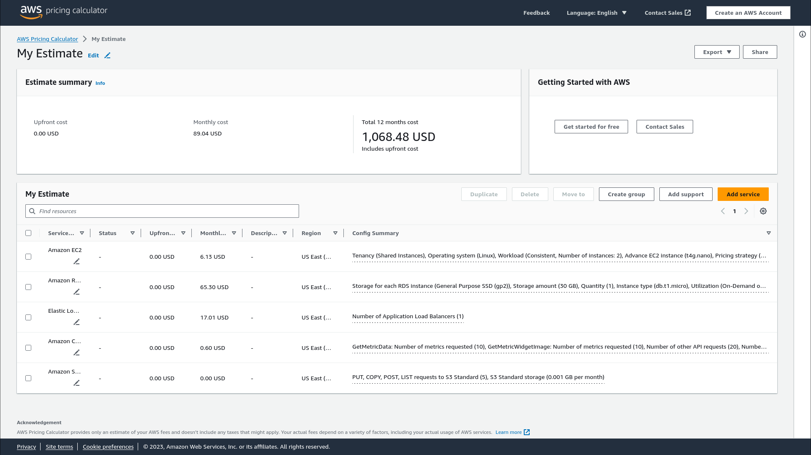

# Projeto-Cloud

## Rodando o projeto

O primeiro passo para rodar o programa é instalar o terraform na sua máquina. Um tutorial para o seu sistema operacional pode ser encontrado no link https://developer.hashicorp.com/terraform/install.

O segundo passo é instalar a cli da AWS. Instruções de instalação podem ser encontradas nesta pagina web https://docs.aws.amazon.com/cli/latest/userguide/getting-started-install.html#cliv2-linux-install

Com isso, logue suas credênciais na CLI da aws, usando as seguintes variáveis de ambiente:
<code>
export AWS_ACCESS_KEY_ID=YOURACCESSKEYID
export AWS_SECRET_ACCESS_KEY=YOURSECRETACESSKEY
export AWS_DEFAULT_REGION=us-east-1
</code>

Então, crie uma chave ssh na sua pasta ~/.ssh com o nome instancekp. Caso queira usar outro nome para a chave, basta trocar o caminho do arquivo na linha 152 para o nome desejado.
A chave pode ser criada com o seguinte comando:
<code>
ssh-keygen
</code>

Em seguida, após instalar o projeto na sua máquina e entrar nele, rode os seguintes comando:

<code>
terraform init
terraform apply
</code>

Com apenas esses comando, o programa pedirá para que você infome alguns parâmetrs pela linha de comando. Para evitar isso, crie um arquivo secrets.tfvars (recomendado que em um diretório separado *QUE NÃO SEJA UM REPOSITÓRIO GIT*, para evitar a possibilidade de vazamento das suas credênciais). Segue um exemplo desse arquivo

<code>
db_username = "myusername"
db_password = "mypassword"
my_ip = "0.0.0.0"
</code>

Com um arquivo assim, o comando apropriado é
<code>
terraform apply -var-file="../secrets.tfvars"
</code>

**Se der erro na criação do bucket, altere o nome**

## Região usada
A região escolhida foi a us-east-1.

A região us-east-1 da AWS é uma das regiões mais antigas e amplamente utilizadas. Ela é composta por seis zonas de disponibilidade e dez zonas locais . No entanto, essa região também é conhecida por ter experimentado várias falhas e interrupções no passado .

De acordo com este artigo, https://openupthecloud.com/which-aws-region-cheapest/, a região é a mais barata disponível (considerando que faltam dados sobre a região de OHIO(us-east-2)). Com isso, tendo como objetivo principal a minimização de custos para a instituição que está pagando a hospedagem dos serviços, e já que o serviço não precisa de altíssima disponibilidade, já que ela não é uma preocupação muito relevante, dado que este é um projeto educacional.
## VPC
Para ter toda a infraestrutura seguinte, foi criada uma VPC onde todos os componentes existem.
## Subnets
Para garantir a privacidade da nossa base de dados, e acessibilidade ao load balancer, e consequentemente, nossas instâncias, foram criadas 2 redes públicas e duas redes privadas. Enquanto as redes públicas tem os blocos de CIDR <code>10.0.1.0/24</code> e <code>10.0.2.0/24</code>, as redes privadas ocupam os blocos CIDR<code>10.0.101.0/24</code> e <code>10.0.102.0/24</code>
## Gateway
Para o acesso dessas redes, foi criado um gateway. Esse gateway tem acesso à duas tabelas de roteamento. Enquanto a pública aceita acesso de computadores de fora da VPC (IE a sua máquina), a tabela da rede privada permite apenas que endereços da VPC se comuniquem com quem está dentro da rede privada.
## Security group
Para garantir que o acesso que ocorresse fosse apenas por SSH ou HTTP, foi criado um security group com permissão de ingresso nas portas 80 e 22.
## Load Balancer
Para que o acesso à nossa API fosse acessado dinâmicamente, foi criado um Load Balancer, para automáticamente distribuir a carga. Ele tem acesso às duas subnets públicas. O grupo alvo dele tem apenas acesso à porta 80 (onde está sendo hospedado o servidor nas nossas instâncias) com o protocolo HTTP.Usamos um target group para apontar para o nosso autoscaling group.
## Autoscaling Group
O autoscaling group cria de 1 a 5 instâncias nas duas redes públicas criadas (desired é de 2 redes públicas). As políticas tanto de scale up quanto de scale down são controladas por alarmes, que checam a utilização de CPU. As instâncias criadas usam UBUNTU como sistema operacional, e usama chave SSH criada anteriormente, caso seja necessário o acesso delas.
## Aplicação 
A aplicação é uma API com um CRUD básico, feita usando o framework em python FASTAPI. O repositório original pode ser encontrado no link  https://github.com/AndreCorreaSantos/simple_python_crud (Agradecimentos especiais ao Andre Correa Santos por liberar o uso da API nesse trabalho).
A aplicação se conecta com o RDS server, fazendo todas as operações na instância da RDS, que é separada da instância da aplicação;
## RDS
Foi criada uma única instância da database. Essa instância está apenas nas subrede privada, para impedir que não sejam feitas requisições à ela de fora da nossa VPC. O programa usado para a base de dados é o MYSQL 8, acessível na porta 3306 da instância criada. 
## Cálculo de preço

